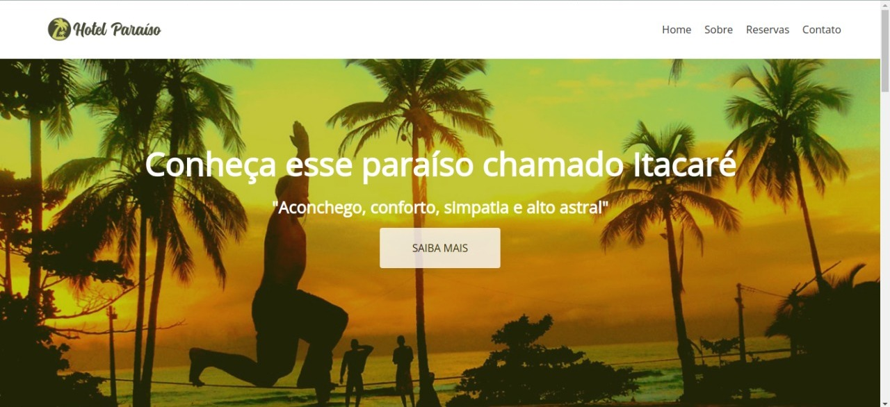
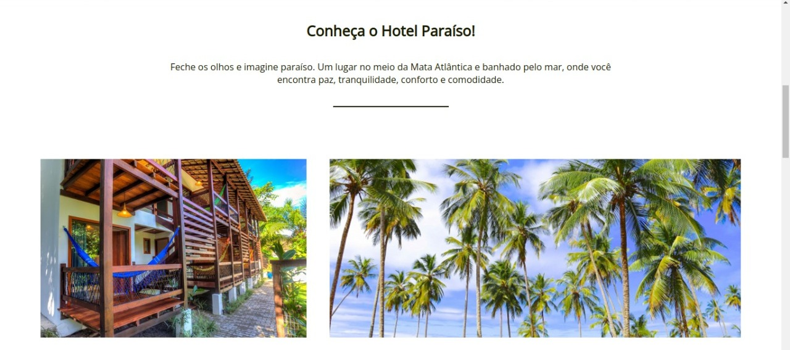
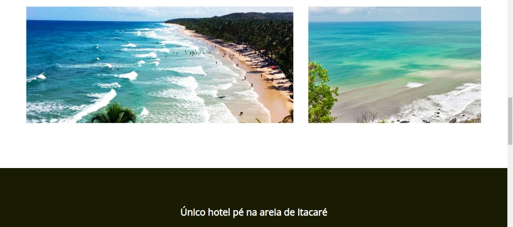
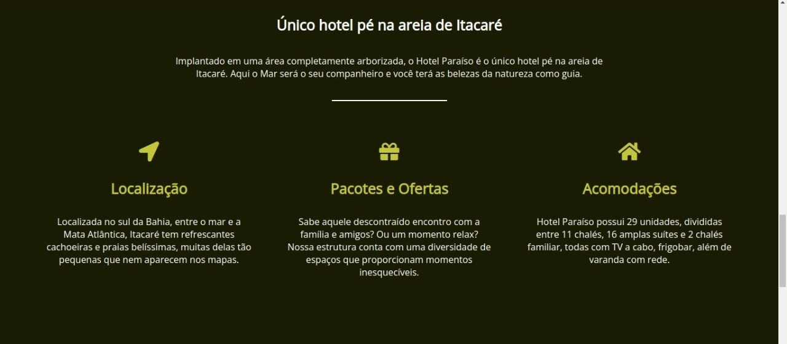
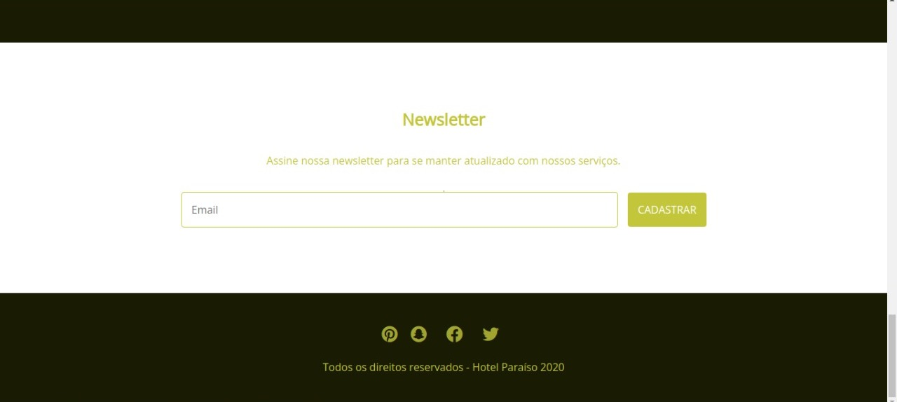

# LandingPageFlexbox
  Primeira landing page usando `CSS`, `HTML`, `JS` e colocando em pratica o aprendizado recente de manipulaçao de flexbox. Para adaptação dessa pagina em diferentes tipos de dispositivos (smartphone,tablet, notebook, etc) foi utilizado CSS responsivo - Mobile first.

Neste projeto, foi desenvolvida uma pagina de um hotel em frente a praia em itacare, e foi testado e verificado as aplicaçoes abaixo:
* LandingPag em HTML;
* CSS Flexbox para criar layouts flexíveis;
* Regras CSS específicas para serem aplicadas a dispositivos móveis;
* Construir páginas que alteram o seu layout de acordo com a orientação da tela (MobileFirst);

Pode-se observar o resultado pela demonstraçao abaixo:

